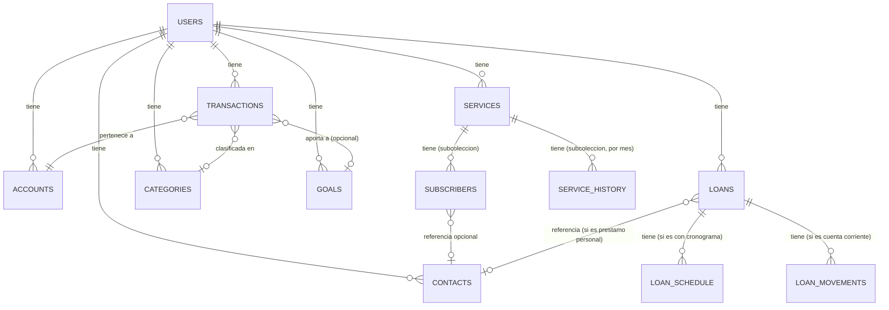

# EVA — Modelo de Datos (Firestore)

> Depende de `docs/01-alcance-y-fases.md`. Este documento traduce las interfaces de TypeScript ya existentes (`src/interfaces/`) a colecciones reales de Firestore, e incorpora los hallazgos del Excel de contabilidad manual (`CONTABILIDAD-ShiroVs.xlsm`) que no estaban contemplados en el código.

## 1. Principios de diseño

Firestore es NoSQL orientado a documentos — no hay JOINs ni foreign keys reales. Las reglas que se siguieron:

1. **Aislamiento por usuario vía subcolecciones.** Todo dato de un usuario vive bajo `users/{uid}/...`. Esto simplifica las reglas de seguridad a una sola línea (ver sección 6) y evita tener que filtrar por `uid` en cada query.
2. **Evitar arrays que crecen sin límite.** El modelo actual en memoria guarda `historial_pagos` como un array dentro del objeto `Subscription`. Eso funciona con datos mock, pero en Firestore un documento tiene un límite de 1MB y un array que crece cada mes durante años eventualmente lo revienta (o, antes de eso, ya es lento de leer/escribir completo solo para agregar un mes). **Se separan en subcolecciones** los datos que crecen indefinidamente (historial de pagos, cronograma de préstamo, movimientos de cuenta corriente).
3. **Desnormalizar cuando el costo de recalcular es alto.** Ejemplo: el saldo de un préstamo tipo cuenta corriente se guarda como campo (`saldo_actual`) en vez de sumar todos los movimientos en cada lectura — se actualiza en la misma escritura que crea el movimiento.
4. **Nunca borrar, marcar como inactivo.** Esto resuelve directamente el problema que planteaste con las suscripciones: un suscriptor que deja de pagar no se elimina, se marca `activo: false` con `fecha_salida`, y su historial de deuda queda intacto.

## 2. Diagrama general



## 3. Colecciones

### 3.1 `users/{uid}`
Documento raíz, uno por usuario autenticado (coincide con el `uid` de Firebase Auth).

```
uid: string
correo: string
nombre_pantalla: string
moneda_principal: string          // ej. "PEN"
foto_url?: string
preferencias_ia: {
  auto_categorizar: boolean
  asistente_voz: boolean
}
fecha_creacion: Timestamp
```
Sin cambios respecto a la interfaz `User` actual.

---

### 3.2 `users/{uid}/accounts/{accountId}`
Sin cambios respecto a la interfaz `Account` actual — ya contempla débito, crédito y billetera digital (Yape/Plin encajan como `tipo: "billetera_digital"`).

```
id, nombre, tipo, saldo_actual, id_cuenta_padre?,
es_billetera_digital, limite_credito?, dia_corte?, dia_pago?,
color, icono, es_predeterminada, excluir_del_total
```

---

### 3.3 `users/{uid}/services/{serviceId}`
Reemplaza a `Subscription`. **Unifica streaming y servicios del hogar** (Luz, Agua, Internet) en una sola colección, con un campo `tipo_servicio` para diferenciarlos en reportes sin duplicar lógica de cobro/prorrateo/FIFO.

```
id: string
nombre: string                    // "Netflix", "Luz", "Internet"
tipo_servicio: "streaming" | "hogar" | "otro"     // NUEVO campo
costo_total_actual: number
dia_cobro: number
frecuencia: "mensual" | "anual"
es_compartido: boolean
id_cuenta_pago: string            // referencia a accounts/{accountId}
fecha_inicio: Timestamp
color?, icon?
```

**Cambio importante:** `suscriptores` e `historial_pagos` dejan de ser arrays embebidos y pasan a ser subcolecciones.

#### `.../services/{serviceId}/subscribers/{subscriberId}`
```
id: string
nombre: string
id_contacto?: string              // referencia opcional a contacts/{contactId}
cuota: number
es_cortesia: boolean
activo: boolean                   // NUEVO — false = ya no participa, pero se conserva
fecha_inicio: Timestamp
fecha_salida?: Timestamp          // NUEVO — cuándo dejó de ser suscriptor activo
pagado_hasta: Timestamp
color?: string
```
Con `activo: false` en vez de borrar la fila, el historial de deuda de alguien que salió del servicio (como los casos de "Prime Video" en tu Excel) se sigue viendo en `service_history`, y la UI simplemente deja de mostrarlo en la lista de "suscriptores actuales".

#### `.../services/{serviceId}/history/{mesId}`
El id de documento es el mes en formato `"2026-07"` (ordenable y sin colisiones), no un array.

```
mes_anio: string                  // "Julio 2026" (display)
costo_servicio_momento: number    // lo que se cobra a los suscriptores ese mes
monto_pagado_banco?: number       // YA EXISTÍA en el código — lo que realmente
                                   // se pagó al proveedor (varía por tipo de cambio)
fecha_limite_esperada: Timestamp
fecha_real_pago?: Timestamp
dias_atraso: number
balance_servicio: number
registro_pagos_personas: map<string, boolean>
cuotas_momento: map<string, number>
montos_pagados: map<string, number>
frecuencia_momento: "mensual" | "anual"
id_cuenta_pago_real?: string
ganancia_neta: number             // NUEVO — calculado: sum(montos_pagados) - monto_pagado_banco
```
`ganancia_neta` es exactamente el "Gasto" (ganancia/pérdida) que ya calculas a mano en la hoja `PAGO SUSCRIPCIONES`. No hace falta un campo nuevo en el código actual — ya tienes `costo_servicio_momento` (≈ tu columna "Recaudo" cuando lo multiplicas por suscriptores) y `monto_pagado_banco` (tu columna "Pago"). Solo falta la resta, calculada al guardar el historial del mes.

---

### 3.4 `users/{uid}/contacts/{contactId}`
Sin cambios estructurales. `total_deuda` y `total_servicios` se mantienen como calculados en el cliente (no se guardan en Firestore, para no tener que mantenerlos sincronizados en cada pago).

```
id, nombre, color, telefono?
```

---

### 3.5 `users/{uid}/loans/{loanId}`
Reemplaza a `Loan`, con un cambio central: **se distinguen tres modalidades**, no un tipo genérico.

```
id: string
modalidad: "bancario" | "personal_con_cronograma" | "personal_cuenta_corriente"   // NUEVO
entidad?: string                  // nombre del banco (solo si modalidad = "bancario")
id_contacto?: string              // referencia a contacts/{contactId}
                                   // obligatorio si modalidad empieza con "personal_"
rol: "deudor" | "acreedor"        // NUEVO — ¿el usuario debe, o le deben?
monto_total_prestado: number
tasa_interes?: number             // opcional en personal, informativo en bancario
numero_cuotas_totales?: number    // no aplica en cuenta_corriente
saldo_actual: number              // NUEVO, desnormalizado — para cuenta_corriente
                                   // es la fuente de verdad; para las otras dos
                                   // modalidades se recalcula desde el cronograma
fecha_inicio: Timestamp
estado: "activo" | "cerrado"
```

**Por qué `rol`:** hoy `Loan` asume implícitamente que el usuario es quien debe. Con préstamos personales, el usuario puede ser quien presta (le deben a él) — el mismo documento sirve para ambos casos, cambia quién debe a quién, no la estructura.

**Cálculo de cuota con interés (préstamo personal con cronograma):** cuando se configura `tasa_interes`, EVA calcula automáticamente el monto de cada cuota (interés simple sobre saldo o francés, por definir en el documento técnico de implementación — no es una decisión de modelo de datos). Para el préstamo bancario, `tasa_interes` y `cronograma` son solo informativos: el usuario los ingresa (a mano o vía escaneo del documento del banco en la Fase 6), EVA no recalcula nada, solo muestra y alerta sobre fechas.

#### `.../loans/{loanId}/schedule/{cuotaId}`
Solo existe si `modalidad` es `"bancario"` o `"personal_con_cronograma"`.
```
numero_cuota: number
monto_cuota: number
fecha_vencimiento: Timestamp
estado: "pagado" | "pendiente" | "vencido"
monto_mora_acumulado: number
fecha_real_pago?: Timestamp
```
Igual a `LoanSchedule` actual, sin cambios.

#### `.../loans/{loanId}/movements/{movementId}`
Solo existe si `modalidad = "personal_cuenta_corriente"` — es el equivalente estructurado a tu hoja `DEUDORES`.
```
id: string
monto: number                     // positivo = aumenta la deuda, negativo = abono/pago
descripcion: string                // "comida vecino", "cine", "prestamo"
fecha: Timestamp
```
Cada movimiento nuevo actualiza `saldo_actual` en el documento padre `loans/{loanId}` (en la misma transacción de escritura).

---

### 3.6 `users/{uid}/transactions/{transactionId}`
Sin cambios respecto a `Transaction` actual.

```
id, monto_total, tipo, descripcion, fecha, id_cuenta,
id_meta_destino?, tiene_desglose, detalles_desglose?,
url_comprobante?, entrada_ia_cruda?
```

---

### 3.7 `users/{uid}/categories/{categoryId}`
Sin cambios estructurales — `presupuesto_mensual` ya existe, solo falta construir la lógica de alerta (Fase 2) que compara transacciones del mes contra este valor. No requiere un campo nuevo.

```
id, nombre, icono, color, presupuesto_mensual, creada_por_ia
```

---

### 3.8 `users/{uid}/goals/{goalId}`
Sin cambios respecto a `Goal` actual.

```
id, nombre, monto_objetivo, monto_actual, fecha_limite, prioridad
```

---

### 3.9 `users/{uid}/integrations/email` (documento único, no colección)
Nuevo, para la Fase 7 (lectura de correo). **El token OAuth de Gmail nunca se guarda en este documento** — Firestore no es el lugar correcto para secretos de este tipo. Aquí solo va el estado de la conexión; el token vive en Secret Manager o en la propia infraestructura de Cloud Functions, referenciado por `uid`.

```
conectado: boolean
correo_conectado?: string
proveedores_activos: string[]     // ["yape"], luego ["yape", "plin", "transferencia"]
ultima_sincronizacion?: Timestamp
```

---

### 3.10 `users/{uid}/deviceTokens/{tokenId}`
Nuevo, para la Fase 5 (notificaciones push vía Firebase Cloud Messaging).
```
token: string
plataforma: "ios" | "android" | "web"
fecha_registro: Timestamp
```

## 4. Cambios que esto implica en las interfaces TS actuales

| Interfaz | Cambio |
|---|---|
| `Subscription` | Pasa a llamarse conceptualmente `Service` (o se mantiene el nombre, a decidir). Se agrega `tipo_servicio`. `suscriptores` e `historial_pagos` dejan de ser arrays embebidos en el tipo — siguen existiendo como tipos TS para uso en frontend, pero se leen/escriben como subcolecciones. |
| `Subscriber` | Se agregan `activo` y `fecha_salida`. Se agrega `id_contacto?` opcional. |
| `PaymentHistory` | Se agrega `ganancia_neta` (calculado). |
| `Loan` | Se agregan `modalidad`, `rol`, `id_contacto?`, `saldo_actual`, `estado`. `entidad` pasa a ser opcional (solo aplica a `modalidad: "bancario"`). |
| `LoanSchedule` | Sin cambios. |
| Nuevo: `LoanMovement` | `{ id, monto, descripcion, fecha }` — no existe hoy, hay que crearla. |
| `Category`, `Goal`, `Account`, `Transaction`, `Contact`, `User` | Sin cambios. |

## 5. Reglas de seguridad (`firestore.rules`)

Como todo vive bajo `users/{uid}/...`, una sola regla cubre todas las colecciones:

```
rules_version = '2';
service cloud.firestore {
  match /databases/{database}/documents {
    match /users/{userId} {
      allow read, write: if request.auth != null && request.auth.uid == userId;

      match /{document=**} {
        allow read, write: if request.auth != null && request.auth.uid == userId;
      }
    }
  }
}
```
El token de Gmail (Fase 7) nunca pasa por reglas de Firestore porque nunca vive en Firestore — se maneja completamente en Cloud Functions con Secret Manager.

## 6. Índices compuestos necesarios

Firestore exige índices compuestos para queries con múltiples condiciones. Los que ya se pueden anticipar:

- `transactions`: `id_cuenta` (==) + `fecha` (orden desc) — para el historial de una cuenta.
- `transactions`: `tipo` (==) + `fecha` (orden desc) — para filtrar ingresos/egresos en el Dashboard.
- `services/{id}/history`: orden por `mes_anio` — normalmente no requiere índice compuesto porque el id de documento ya es ordenable (`"2026-07"`), pero si se filtra además por `registro_pagos_personas.NOMBRE` sí lo va a pedir.
- `loans`: `modalidad` (==) + `estado` (==) — para listar préstamos activos por tipo.

Firestore avisa en tiempo de ejecución (con un link directo a crear el índice) la primera vez que una query los necesita — no hace falta crearlos todos de antemano, solo tenerlo presente para no sorprenderse en producción.

## 7. Nota sobre migración desde el mock

Este documento define el modelo destino. La migración real de cada `Service` (`AuthService`, `AccountService`, etc.) de `mockDatabase` a Firestore es trabajo de código, no de este documento — corresponde a la Fase 0 definida en `docs/01-alcance-y-fases.md`.
